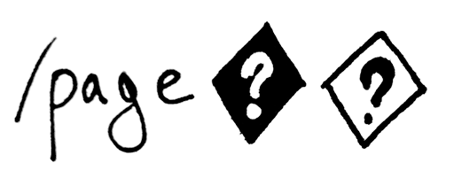

# strict_request_uri

Reject requests with an invalid REQUEST_URI at the gate.
Some HTTP clients will happily append raw junk bytes to your URL before doing a request. Others
will first append junk, and then URL-encode it.

What you want for a valid URL is something that is

* properly URL-encoded
* is valid UTF-8 once URL-decoded

This gem provides a Rack middleware that is going to try to decode REQUEST_URI, and if it
cannot be decoded, an error page will be rendered instead.

    use StrictRequestUri do |env|
      # You can use the preserved invalid path+qs to do additional checks/logging
      logger.warn "Invalid URL received"
      logger.warn env['strict_uri.original_invalid_url']
      
      # You can also render a suggestion or redirect based on the suggested fixed URL.
      # The fixed URL will have all junk at the end removed until the string becomes a valid URL.
      logger.warn "Suggested instead:"
      logger.warn env['strict_uri.proposed_fixed_url']
      
      [400, {'Content-Type' => 'text/plain'}, ['This is a no go mate']]
    end

Note that `PATH_INFO` and `QUERY_STRING` variables in Rack env are going to be replaced
with something harmless (because they get used to render self-URLs and so on).

You can also use it in your Rails middleware stack, and render a controller in return

    Rails.application.config.middleware.insert_after 'Warden::Manager', StrictRequestUri do | env |
      ErrorPagesController.action(:invalid_url).call(env)
    end

## Contributing to strict_request_uri
 
* Check out the latest master to make sure the feature hasn't been implemented or the bug hasn't been fixed yet.
* Check out the issue tracker to make sure someone already hasn't requested it and/or contributed it.
* Fork the project.
* Start a feature/bugfix branch.
* Commit and push until you are happy with your contribution.
* Make sure to add tests for it. This is important so I don't break it in a future version unintentionally.
* Please try not to mess with the Rakefile, version, or history. If you want to have your own version, or is otherwise necessary, that is fine, but please isolate to its own commit so I can cherry-pick around it.

## Copyright

Copyright (c) 2015 Julik Tarkhanov. See LICENSE.txt for
further details.

